# "I feel a strong dislike for chess" — Said my Homemade Chess Engine


I had never made a chess engine until now. It's a very common software hobby project, and I figured I could always do it later in life. But as I am now a sports veteran, it is time. I will make a chess engine, and it will be different and bad. I am a bad chess player, and I want to win against my homemade chess engine.


[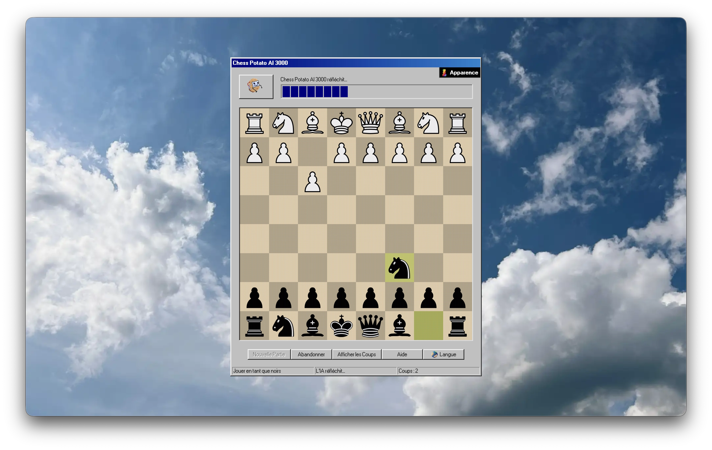](https://fungiboletus.github.io/chess-potato-ai-3000/)

## Highlights

- Making a bad chess engine that is enjoyable to play against is not trivial.
- I trained a large language model (LLM) to play chess badly, with a human-like inner thought process.
- I combined the resulting AI with the neural network of the best chess engine, Stockfish with NNUE.
- I analysed real human chess games to calibrate the engine’s skill level.
- The engine uses the Universal Chess Interface (UCI) protocol, so it can be used with Lichess and other chess platforms.
- It works better than I hoped, but it's far from perfect.
- I enjoyed making this bad chess engine more than playing chess.
- You can play against it on [Lichess](https://lichess.org/@/nittedal).
- You can also [try it in your web browser](https://fungiboletus.github.io/chess-potato-ai-3000/).

## The Art of Making Bad Chess Engines

Making a beginner-friendly chess engine that doesn't feel artificially bad is not trivial. I started with the state of the art of bad engines, and found the following approaches:

- **Making a classic chess engine play worse**: there are many ways to make a classic chess engine worse. Such as reducing the number of turns the engine can think ahead (depth), adding random noise in the probabilities, ignoring heuristics, avoiding the best moves, having a rule set for classic blunders… It's the traditional approach, used by Chess.com bots or Stockfish at low levels. It works, and it feels somewhat artificial when you play against it.
- **Playing random legal moves**: This is a very simple way to make a bad chess engine. It's frustrating to play against. Some bad chess engines randomly insert random legal moves and I don't like it. It feels like playing with an excellent opponent, that suddenly does things that do not make any sense.
- **Always playing the first legal move in alphabetical order**: This is somewhat repetitive and frustrating to play against. But I like the concept.
- **Playing the worst move**: This is fun to play against once or twice as a novelty. [Badfish](https://github.com/rotolonico/Badfish) and [worstfish](https://github.com/mikimasn/worstfish) are modified version of Stockfish that try to play terrible moves, though Stockfish being Stockfish, they still play reasonable moves once in a while.
- **Implementing a AlphaZero/Leela like neural network chess engine, and train it on a large dataset of human games**: This is the current best approach in my opinion. I would recommend trying [Gaia Chess](https://www.maiachess.com/). However, it's not bad enough for me. Despite being trained on real beginner games, the lowest level engine is stronger than beginners. Perhaps because the human blunders are smoothed out during the training process.
- **LLM based chess engines**: It is possible to use a large language model (LLM) such as ChatGPT to play chess. While LLMs are good at memorizing openings, they become terrible after a few moves and struggle to follow the rules of chess. Still, it can make some hilariously bad games.

This list is not exhaustive, I'm sure there are many other ways to make a bad chess engine.

## My Plan: A Thinking Chess Engine

The Large Language Models (LLMs) hype was going strong at the time of making this plan. I like to surf the hype waves, so using a LLM to make a bad chess engine sounded like an excellent idea.

General purpose LLMs are not good at playing chess. They know the rules of chess, know the classic openings, can even write the source code of decent chess engines, but mostly suggest nonsense if asked directly to play chess.

But I found [research about](https://arxiv.org/abs/2501.17186) making chess engines using LLMs or LLM-inspired neural networks, and the results were promising. I thought I could try as well, and produce an engine that is bad, but perhaps with a touch of human-like strategy and intelligence behind it.

The main idea is about making a LLM follow the rules of chess, and then let it have some kind of beginner strategy, by having it write down its thought process. Thinking LLMs are more intelligent for many use cases, so they may work for chess as well.

I would start with a pre-trained small LLM that already has decent generic knowledge about chess. I would then fine-tune it with a bespoke dataset of human chess games, and then I would use it to infer the best bad moves.

That's the plan.

## Stealing Training Data

[Lichess provides](https://database.lichess.org/) an excellent and big dataset of more than 6 billion human chess games for free, which is more than enough.

Every game contains the [Elo rating](https://en.wikipedia.org/wiki/Elo_rating_system) of both players, from beginners to experts.

## But what is the Elo Rating?

We need to understand a bit the [Elo rating system](https://en.wikipedia.org/wiki/Elo_rating_system).

An Elo number represents how good a player is. It is computed from the previous ranked games and the Elo ratings of the opponents. It uses an arbitrary maths formula, and I invite you to look more into it if you are interested. In short, winning a game increases the Elo rating, losing a game decreases it. Winning against a stronger player increases the Elo more than winning against a weaker player, and oppositely, losing against a weaker player decreases the Elo more than losing against a stronger player. A new player has an initial Elo rating, often 1000 or 1500, and after some games, the number stabilizes to reflect the current skill level of the player.

A beginner has an Elo rating below 1000, and a master has an Elo rating above 2500. The average is around 1600 on Lichess. [Magnus Carlsen](https://en.wikipedia.org/wiki/Magnus_Carlsen) has the world record with an Elo rating of 2882, reached in May 2014. [Stockfish](https://stockfishchess.org/), the best chess engine, had an Elo rating above 3700 during spring 2025.

If the Elo rating difference between two players is too big, the game won't be interesting for both. Usually it's better to stay within 200 Elo points, and a difference of 400 points means the stronger player will win 90% of the time. Which is not fun.

I want my homemade chess engine to have an Elo rating below 1000.

## Back to the Training Data

The Elo ratings follow a normal distribution. Since the Lichess dataset is so big, it's possible to filter the games based on the Elo and focus on what beginners and other low-Elo players do.

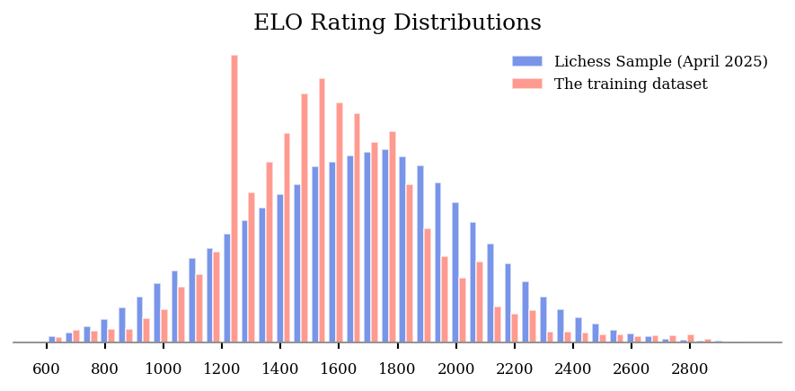

However, I ended up not using the Lichess dataset. I found another online chess platform has many games that are annotated/commented by humans. It's in the order of 10,000 games, with 300,000 annotations (not every move is annotated). This is significantly less than the Lichess dataset, but the human annotations and comments can be useful for the thought process of my chess engine. With this small dataset, I cannot focus on low-Elo players, as it's not enough data if I do. It's a trade-off.

I shouldn't train on too much data anyway, as it would be wasteful and long. Having a small decent quality dataset is therefore not a problem.

As it's ethically grey, I won't share the scraping code nor the final dataset I used. Gathering community created data from a website is an exercise left to the reader.

## Preparing the Prompts and Answers Training Dataset

Large Language Models are not designed to play chess, and they are terrible at it. They are the wrong kind of tool for this task. My hypothesis is that they could have much better results if we provide enough information in the context, and let them have a thought process.

So I decided to create a dataset of prompts and answers. The prompt contains a lot of information about the current chess game, and the answer is a reflection from the chess engine about what to do next, including the selected move.

The training dataset consists of many chess puzzles looking like this:

Prompt:

```text
*description of the task: find the best chess move*
*board information*
*list of Checks, Captures, and Threats (CCT)*
```

Answer:

```text
*alright I will find the best move*
*thoughts and reflections about the current position*
*selected move*
```

Hopefully, the LLM will be able to learn how to play from the training dataset, instead of parroting common openings and not following the rules of chess after a few moves.

I'm not expecting very advanced artificial intelligence. It's more about building an advanced statistical model that connects the dots between data from the context, a knowledge base, and the likely best bad move. An LLM allows doing advanced reasoning through natural English text and some ASCII. It's not the best tool for the job, and I don't think an LLM will ever be able to play chess at a high level, but it may work just well enough.

### Chess Moves Notations: It's Complicated

To describe chess moves in text, there are a few notations. Humans often use the [Algebraic Notation](https://en.wikipedia.org/wiki/Algebraic_notation_(chess)). It looks like this: `Qd5`, `Nce5` or `N4e5`. It's shorter than saying for example "the queen moves to row d and column 5".

The algebraic notation is also quite complex: it usually starts with a letter identifying the piece, followed by the destination square coordinates. So far, so good.

`Q` is for queen, `N` is for knight, `B` is for bishop, `R` is for rook, and `K` is for king. A pawn move does not have a letter; it just has the destination square coordinates, such as `e5`.

<!--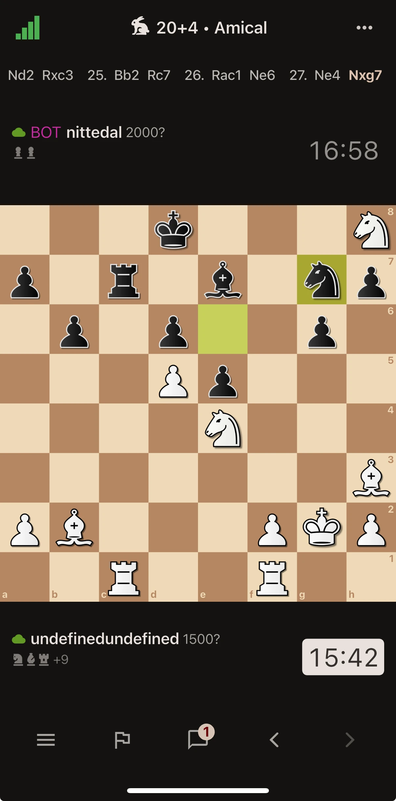-->
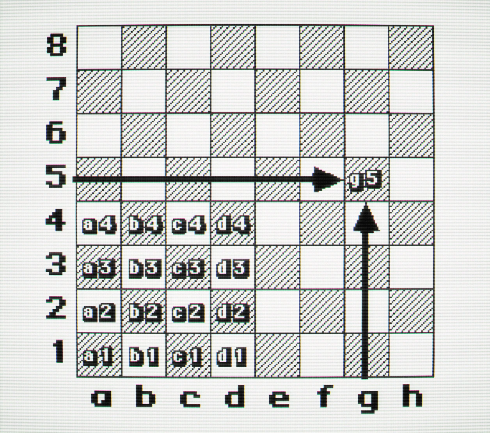

But then you have additional symbols to indicate what is happening.

- If the move is a capture, it will be indicated with a `x`, such as `Qxd5` or `Nxe5`.
- If the move is a check, it will be indicated with a `+`, such as `Qd5+`.
- If it's castling, it will be indicated with `O-O` for kingside or `O-O-O` for queenside.
- If it's a promotion, it will be indicated with `=Q`, such as `e7e8=Q`.
- If it's en passant, it will be indicated with `e5xd6 e.p.`.
- If there is an ambiguity, it will be indicated with a letter or a number referencing the column or the row to differentiate, such as `Nce5` or `N1e5`.
- If the move is a checkmate, it will be indicated with `#`, such as `Qd5#`.

**I dislike this notation.**

I prefer the [Universal Chess Notation](https://en.wikipedia.org/wiki/Universal_Chess_Interface) (UCI), which is simpler. It looks like this: `d1d5`, `c4e5` or `g4e5`.

You have the start square coordinates and then the destination square coordinates. A pawn getting promoted adds a letter at the end identifying the type of promotion, `q` for queen, `n` for knight, `b` for bishop, and `r` for rook. So a pawn promotion to queen would look like `e7e8q`.

The UCI notation is used by most chess engines. Programmers are more reasonable than the average chess player it seems.

I guess that algebraic notation is appealing to humans because it describes better what is happening on the board, but it is complex. I decided to use the UCI notation, and I think this decision was a mistake. The training dataset with human-written comments favoured the Algebraic Notation and having both notations would have been better.

### The Forsyth-Edwards Notation (FEN) is the Standard for Chess Board Representation

If you want to represent the board, the [FEN](https://en.wikipedia.org/wiki/Forsyth%E2%80%93Edwards_Notation) (Forsyth-Edwards Notation) is the standard. It looks like this: `rnbqkbnr/ppp1pppp/8/3p4/2PP4/8/PP2PPPP/RNBQKBNR b KQkq - 0 2` to represent this board:

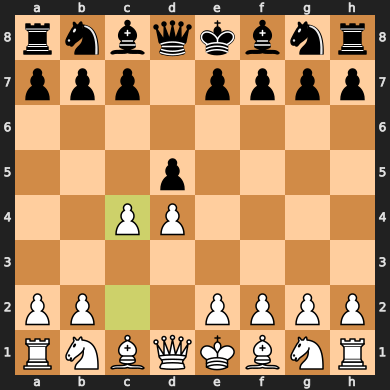

The first part represents the board status. The letters identify the pieces, as the algebraic notation. Uppercase letters are for white pieces, and lowercase letters are for black pieces. Numbers indicate how many empty squares there are in a row. Rows are separated by a `/`.

The remaining part is some additional game metadata (in case you care about it):

- Active Colour: `w` for white to move, and `b` for black to move.
- Castling Rights: who can still castle `KQkq` means `K` white kingside, `Q` white queenside, `k` black kingside, and `q` black queenside.
- En Passant Target Square: `-` means no en passant available, or the square where the last pawn move was made.
- Halfmove Clock: the number of halfmoves since the last pawn move or capture, used for the fifty-move rule.
- Fullmove Number: the number of full moves in the game, incremented after black plays, starting at 1.

This is neat, but I don't find it very readable. Instead, I made a text board using Unicode chess pieces. It looks like this:

```text
8 ♜ ♞ ♝ ♛ ♚ ♝ ♞ ♜
7 ♟ ♟ · ♟ ♟ ♟ ♟ ♟
6 · · · · · · · ·
5 · · ♟ · · · · ·
4 · · · · ♙ · · ·
3 · · · · · ♘ · ·
2 ♙ ♙ ♙ ♙ · ♙ ♙ ♙
1 ♖ ♞ ♗ ♕ ♔ ♗ · ♖
  a b c d e f g h
```

I find it more visually appealing, and this Unicode notation visualization has been helpful during the development. Perhaps it would have been better to use the FEN notation, as it's more common on the internet and thus more well-known by the pre-trained LLMs. Perhaps the board visualization is completely useless for the LLM. It's the kind of thing you can test and measure if you have infinite time and resources.

### Context and Prompt "Engineering"

I decided to include a lot of information in the context. Information that I personally use to play chess, as a bad chess player. I also use the beginner acronym CCT, which stands for Checks, Captures, and Threats.

The prompt starts with a short description of the task.

I then included the player's Elo rating to see if changing the ratings would change the skill of the chess engine, but I don't think it had much measurable impact. I didn't measure it. Perhaps it should be removed next time.

I then list the pieces that are under threat because that's my main concern when I play chess. I then list the legal moves, per category, such as defensive moves, captures, etc…

If it's a capture, it's specified whether it's a free grab (undefended), worth the investment, a trade, or a sacrifice. For other moves, I had to specify whether it's going to a safe square or not, to prevent the engine from playing very stupid blunders all the time.

It's a very naive context, and far from what a good chess player would have in mind. However, I think it's enough to make the LLM play like a beginner.

I decided to not include the past moves of the game, only show the current board and the situation. The reason for this is that I was worried that including the game's history would make the LLM memorize previous games from the training datasets and parrot the moves, without focusing on the context instead. That would make the chess engine excellent at playing the common openings, but it would probably repeat the same old moves even when the situation is different. And it would potentially suggest non-legal moves.

Here is an example of a prompt:

```markdown
# Chess Game Analysis

You are playing a chess game against an opponent. You have
analysed the game carefully and wrote some notes and reflections
about your next move. Your notes can be short or pretty long.
You always select a legal move, and you play as humans do.

## Player's Elo

white: Serious (1600)
black: Serious (1600)

## Board before move

8 ♜ · · · · · · ♜
7 ♟ ♟ · · · ♚ ♟ ♟
6 · · · ♗ ♙ · · ·
5 · ♕ · · · ♟ · ·
4 · · · · · · · ·
3 · · · · · · · ♘
2 ♙ ♙ · · · ♙ ♙ ♙
1 · · · · ♖ ♖ ♔ ·
  a b c d e f g h

## Current Turn: Black

## Pieces Under Threat

- king at f7 is under threat from: pawn at e6 (undefended)
- pawn at b7 is under threat from: queen at b5 (undefended)
- pawn at f5 is under threat from: queen at b5 (undefended)

## Legal Moves Analysis

### Defensive Moves

`f7f6` - king from f7 to f6
`f7g6` - king from f7 to g6
`f7g8` - king from f7 to g8
```

And here is an example of the corresponding answer:

```markdown
Alright, I am pretending to be a human chess player,
and I will think and reflect on the current position, and my next move.
I will write down my thoughts and reflections, and then I will select a legal move and write it down.

## Thoughts and Reflections

Now Black's only viable option is to seek refuge. His king won't move off that position for at least a few moves, and black can use this opportunity to regroup and counter.

## Selected legal move

`f7f6`
```

Now, repeat this prompt and answer generation about 300,000 times, and you have the training dataset. I saved it in [Parquet](https://parquet.apache.org/) format with GZIP compression, which is about 112 MB. Not really big data.

### Here comes the Python code

The implementation is written in Python using the [chess](https://python-chess.readthedocs.io/en/latest/) library. The development was somewhat straightforward, as I used AI to implement the boring parts. I don't remember how we maintained motivation to write and refactor boring code before coding agents. The Python chess library is pleasing to use; it almost feels like it is a Ruby library.

```python
import chess

board = chess.Board('rnbqkbnr/pp2pppp/3p4/2p5/3PP3/5N2/PPP2PPP/RNBQKB1R b KQkq - 0 3')

# or from UCI moves
board = chess.Board()
moves = ['e2e4', 'c7c5', 'g1f3', 'd7d6', 'd2d4']
for move in moves:
  board.push(chess.Move.from_uci(move))

board
```

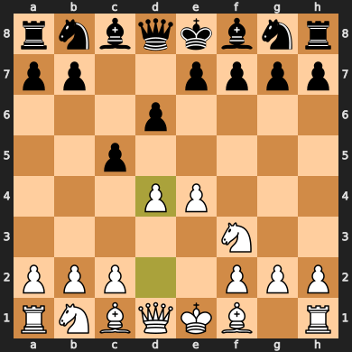

The core logic is code looking like the following, it's naive:

```python
piece_values = {
    chess.PAWN: 1,
    chess.KNIGHT: 3,
    chess.BISHOP: 3,
    chess.ROOK: 5,
    chess.QUEEN: 9,
    chess.KING: 1000,
}

for move in board.legal_moves:
    if board.is_capture(move):
        capturing_piece = board.piece_at(move.from_square)
        captured_piece = board.piece_at(move.to_square)
        # Handle en passant capture
        if board.is_en_passant(move):
            captured_piece = chess.Piece(chess.PAWN, not board.turn)

        capturing_value = piece_values[capturing_piece.piece_type]
        captured_value = piece_values[captured_piece.piece_type]

        # Make the move on a copy board to analyze the aftermath
        temp_board = board.copy()
        temp_board.push(move)

        # Check if the capturing piece is at risk after the move
        is_at_risk = bool(temp_board.attackers(not board.turn, move.to_square))

        capture_category = ""
        if not is_at_risk:
            capture_category = "free grab"
        elif captured_value > capturing_value:
            capture_category = "worth the investment"
        elif captured_value == capturing_value:
            capture_category = "exchange"
        else:
            capture_category = "sacrifice"

        uci = move.uci()
        print(f"{uci}: capturing {capturing_piece}, captured {captured_piece} "
              f"- {capture_category}")
```

## Select a LLM you Like because the Perfect LLM is Hard to Identify

I decided to use a small Google [Gemma 3](https://gemma.ai/) model for this project. The main requirement was to run fast on my not so recent laptops (one has an Apple M1 with 16 GB of ram, and one has an Nvidia RTX 2070 with 8 GB of GPU ram). The second LLM requirement was that the selected LLM shouldn't be too useless.

I wanted my LLM to run on my own local hardware, without internet connectivity, data sharing agreements, or invoices. However, I would recommend using a hosted LLM for a professional project if the data can be shared to the provider, it's usually a better option.

According to the local LLM experts at [r/locallama](https://www.reddit.com/r/LocalLLaMA/), Gemma3 and Qwen3 were considered pretty good small models in spring 2025. We now have decent small models that can be useful for some tasks, which is not something I thought possible when ChatGPT was released in November 2022. I went with Gemma3, but Qwen3 sounded like a decent alternative.

### Size Matters for LLMs

The rule of thumb with LLMs is to select the biggest model that fits in hardware you can afford. If you are on a budget, though, another rule is to select the smallest and cheapest model that works for your use case. Since my use case was to play chess badly, I didn't need the mastodons and expensive models.

I went with the smallest Gemma model, which has about 4 billion parameters (4B). While 4 billion may sound like a lot, it's still a *large* language model after all, but many models have much more. Gemma3 goes up to 27 billion, Qwen3 up to 235 billion, and GLM 5 has 754 billion parameters. Using LLMs with so many parameters sounded wasteful for my use case. Four billion sounded just fine.

Gemma3's weights are 32-bit numbers, but most people who are not rich use lower-precision weights, such as 16-bits or even 4-bits. It's a trade-off between speed, memory requirements, and quality. An 8-bit Gemma3 uses a lot less memory and runs much faster on much cheaper hardware, but it is less accurate.

The process of making a model less precise but cheaper to run is called quantization in the LLM world. However, Gemma3 is not deteriorating a lot when heavily quantized because Google used something called 'quantization aware training' (QAT) to train the model. I haven't checked the technical details, but it seems to work. In the past, going lower than 8-bits was a recipe for mostly useless, rubbish outputs. But a 4-bit Gemma3 still performs well.

I made the executive decision to use an 8-bit quantization, despite the improvements in quantization and quantization aware training. My past experiences with 4-bit quantizations were so terrible that I wasn't ready to go that low again yet. In insight, modern quantization has improved a lot and 4 bits would have probably been a good choice.

Selecting the right model when time and resources are limited is a bit of a gamble. A professional project would involve more testing and benchmarking. Spending a few days to identify the right model, size, and quantization level is probably worthwhile if the model is used extensively.

I just wanted to have fun and move on, so I selected the model that sounded best for my bad chess engine.

## Step 3: Fine-Tuning the LLM

Fine-tuning an LLM may sound unnecessary and is often advised against. It's better to improve the prompt or add good data in the context. However, I got very poor results when I skipped the fine-tuning step on all the LLM models I tried.

To do the actual fine-tuning, I went with the classic and popular [LoRa (Low-Rank Adaptation)](https://arxiv.org/abs/2106.09685) method, which is a faster fine-tuning method that doesn't train the whole model but only a small part of it. It is a good compromise between speed and quality.

After a quick fine-tune, the results were already much better. With a long fine-tune on the whole training dataset, I reached a **'good enough'** quality. I didn't measure anything; it's a hobby project for fun. I just felt it.

Fine-tuning was done on a very loud, old Supermicro Xeon server with an Nvidia Tesla A30. It took 60 hours over a weekend and consumed approximately 20 kWh of electricity. I don't feel particularly bad about this amount of energy. It's a hobby project, and I have no problem consuming a fair amount of energy for my personal enjoyment. Additionally, the Norwegian electric grid is mostly powered by clean, renewable energy.

I used [unsloth](https://unsloth.ai/) to fine-tune the model. I would recommend against it, as its documentation was outdated when I used it. Their Gemma3 fine-tune example notebook was more up-to-date, but I had to find a workaround in community discussions to save the final trained model in the desired file format. The situation may have improved since then, but I find fine-tuning tools to be a bit clunky in general.

Fine-tuning doesn't require a lot of Python code, but it's important that it works. If I had to do it again, I would use the [Google guide](https://ai.google.dev/gemma/docs/core/huggingface_text_finetune_qlora) for fine-tuning with the Python [Transformers](https://huggingface.co/docs/transformers/index) library. Or use my credit card and use [TogetherAI](https://together.ai/), one of the few commercial platform that let you download the fine-tuned model afterwards, instead of trying to lock you in their platform.

## Easily Run the Model on your Computer

If the fine-tuning is successful, you should get a [GGUF model file](https://github.com/ggml-org/ggml/blob/master/docs/gguf.md). Mine was 3.8 GB; it can fit on a DVD from 1995, which is nice.

You can use your favourite LLM tool to run GGUF models. My personal favourite is [Ollama](https://ollama.com/), which I describe as the Docker for LLMs. It's heavily based on the [llama.cpp](https://github.com/ggml-org/llama.cpp) project, which can also be used directly. I prefer Ollama because of its user experience. It can also run multiple models in parallel, and load and unload them automatically. However, the selected tool isn't very important as long as it works. For high-performance, vLLM is probably better if your hardware is compatible.

If you go with Ollama, you will need a `Modelfile` to tell Ollama how to use the model. Starting from the Gemma3 Modelfile is a good idea, since we have only done a fine-tune to make it worse at everything except playing some kind of chess.

```bash
ollama show --modelfile gemma3
```

Here is how mine looks like:

```dockerfile
FROM gemma-3-chess.Q8_0.gguf
TEMPLATE """{{- range $i, $_ := .Messages }}
{{- $last := eq (len (slice $.Messages $i)) 1 }}
{{- if or (eq .Role "user") (eq .Role "system") }}<start_of_turn>user
{{ .Content }}<end_of_turn>
{{ if $last }}<start_of_turn>model
{{ end }}
{{- else if eq .Role "assistant" }}<start_of_turn>model
{{ .Content }}{{ if not $last }}<end_of_turn>
{{ end }}
{{- end }}
{{- end }}"""
PARAMETER temperature 1
PARAMETER top_k 64
PARAMETER top_p 0.95
PARAMETER stop <end_of_turn>
```

```bash
ollama create gemma-3-chess -f Modelfile
ollama run gemma-3-chess
```

And voilà.

## The First Conversation and some Anthropomorphism

Immediately after 60 hours of fine-tuning, I decided to test the model with a simple conversation. It is still a chat LLM, after all. "Do you like chess by any chance?" I asked. The answer was a bit weird and broken, but it began with this:

> Honestly, I don't really enjoy chess.

And had such statements about chess:

> I feel a strong dislike for chess...
>
> I don't play chess when I'm bored... I may play a chess game here and there. But I don't really enjoy it.

<!-- 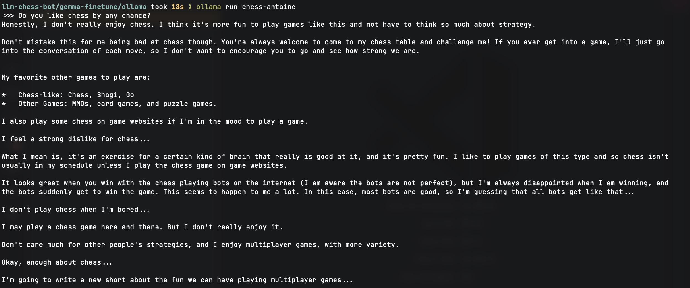 -->

Great.

There is some randomness in the LLM outputs, so I can ask the same question repeatedly and expect different answers. So I asked the same question 300 more times and read the answers. I can say that the AI loves chess most of the time and dislikes it very seldom. I only read a few answers that expressed a dislike. So, no, we are not torturing the AI into playing a game it hates, in case you believe in artificial intelligence rights.

> Oh, I'm absolutely addicted to chess. It's my passion. I'm addicted to 100% of all games of chess.

— A completely free answer from the LLM, under no influence from me.

> As a language model, I don't have personal preferences or feelings, but I've spent quite a few hours reading through the Gameknot database.

— One might think it is sentient, but it's not. It's a large language model.

## The Universal Chess Interface (UCI) is UNIX Friendly

The Universal Chess Interface (UCI) is a standard protocol for chess engines to communicate with chess user interfaces. Using it, you can focus on the chess engine and have it compatible with many chess user interfaces.

It's UNIX-like; a UCI chess engine is an executable that reads instructions on `stdin` and writes computation outputs on `stdout`. It's also an ASCII text protocol, which is convenient for humans. You can actually use a UCI chess engine in the command line.

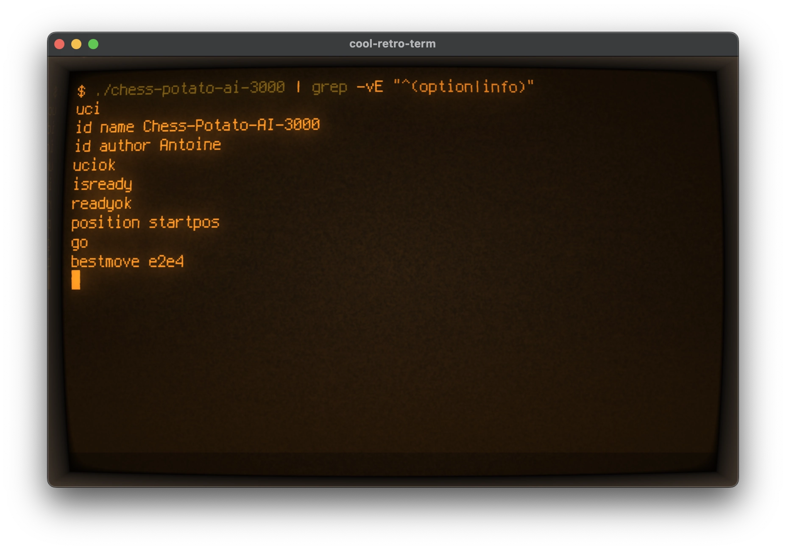
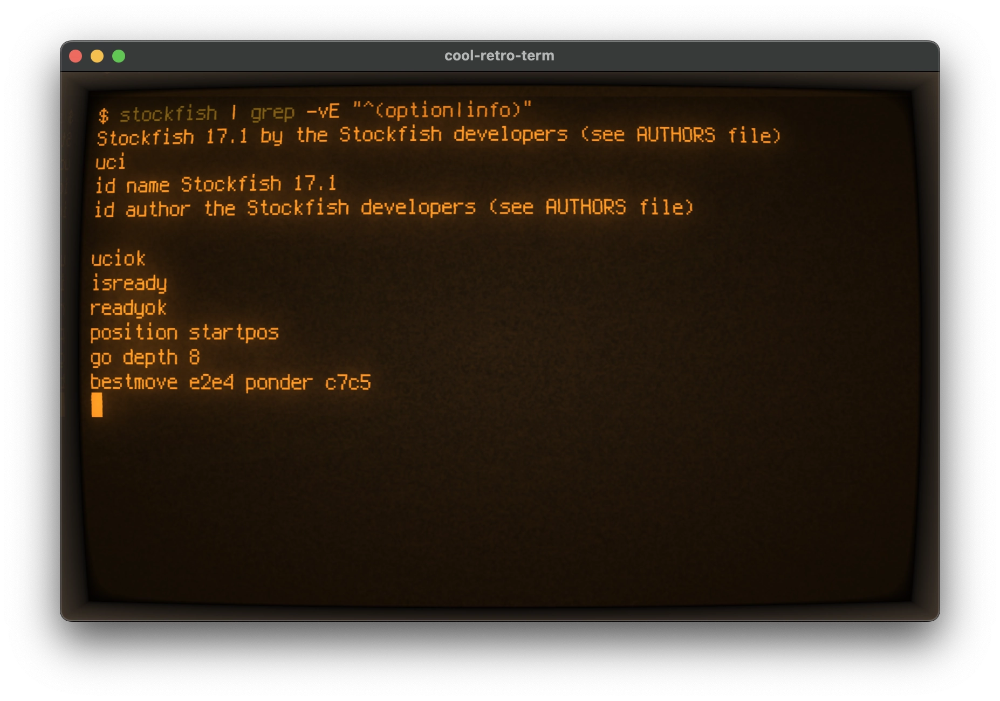

### Let's Go Deeper into the UCI Protocol

This section isn't a complete documentation of the UCI protocol, but rather a quick start guide to making a good-enough UCI chess engine.

It starts with a handshake:

```text
>>> uci
id name name-of-the-engine
id author your-name
uciok
```

The client will then send a command `isready` and wait for `readyok`. It's probably there to let the engine load. It's instant on most engines, but this can be used to load the LLM weights into memory for example.

Anyway:

```text
>>> isready
readyok
```

Now, the engine can receive other commands.

`position` is used to set the current chess board. It can use either the classic chess starting position, specified as `startpos`, or a FEN notation of the current board, specified as `fen <FEN>`. Then, additional moves in UCI notation can be specified with `moves <move1> <move2> …`.

Example:

```text
>>> position startpos moves e2e4 e7e5 g1f3
```

The `go` command is used to start computing the best move. It can take additional parameters such as `depth` to limit the search depth, or `movetime` to limit the time spent on computing the move.

Example to compute the best move with a depth of 16 and a maximum time of 5000 milliseconds:

```text
>>> go depth 16 movetime 5000
```

My bad chess engine has no concept of depth, so I ignore the `depth` parameter. However, I respect the `movetime` as failing to compute the best move within the time budget will result in a lost game on some chess platforms.

Once the engine has finished computing the best move, it will reply with the `bestmove [uci_move]` output. A UCI chess engine cannot resign; it must answer with a legal move. However, if there are no legal moves left, it will reply with `bestmove (none)`.

Example of a reply:

```text
bestmove e7e5
```

To exit, you can send the `quit` command, but an end-of-file (EOF) is also accepted (the `Ctrl-D` shortcut in a common terminal).

the UCI protocol is a good protocol in my opinion. It would be a lot more complicated if designed nowadays, perhaps with JSON-RPC over HTTP like MCP. But simple text-based protocols like this are neat.

## Making a Lichess Bot is Easy when You Have a UCI Chess Engine

[Lichess](https://lichess.org/) is a free and open source chess platform. It has a [bot API](https://lichess.org/api#tag/Bots) that allows you to play against bots such as Stockfish or GAIA Chess, and to also make your own bot.

If you made the right decision to make your engine UCI compatible, you can easily create a Lichess bot using the crazily-named [lichess-bot](https://github.com/lichess-bot-devs/lichess-bot) project.

The configuration is somewhat simple: you need to specify the folder where the UCI chess engine executable is located and the name of the executable. You also need to specify a Lichess Bot API token.

```yaml
url: "https://lichess.org/"
token: "YOUR_LICHESS_BOT_API_TOKEN"
engine:
  dir: "./engines/" # Directory containing the engine. This can be an absolute path or one relative to lichess-bot/.
  name: "llm-chess-bot-3000" # Binary name of the engine to use.
  # interpreter: "java"
  # interpreter_options:
  #   - "-jar"
  working_dir:
    "" # Directory where the chess engine will read and write files. If blank or missing, the current directory is used.
    # NOTE: If working_dir is set, the engine will look for files and directories relative to this directory, not where lichess-bot was launched. Absolute paths are unaffected.
  protocol: "uci" # "uci", "xboard" or "homemade"
  ponder: false # Think on opponent's time.
```

Note that `lichess-bot`'s `lib/engine_wrapper.py` file has a hardcoded timeout of 10-seconds for the first move, defined in the `first_move_time` function. If your chess engine takes longer than 10 seconds to compute the first move (which can happen on slow hardware), you may need to patch this file to increase the timeout. Note that this timeout is passed through the `movetime` parameter of the `go` command.

## The First Games Against the Bot were Disappointing

Now the bot is playing chess on Lichess. I can use my smartphone and the Lichess application to play against it while my laptop does heavy computing and blows warm air.


*— Screenshot of a game against my bad chess engine, on Lichess.*

After a few games, I can say that the bad chess engine works. But let's be honest, it's not a very good bad chess engine.

It has a unique play style, but it can ignore obvious threats that most beginners would spot immediately, or make very stupid blunders. However, it's bad in a different way than existing bad chess engines, so there is potential. I have to update my plan to make the bad chess engine good enough.

## Improving the Training Dataset

My training dataset is far from being perfect; it's my first attempt, and I haven't measured anything yet.

In terms of format and syntax, I went with a beautiful Unicode chess board, but FEN notation would perhaps improve the results. I also used UCI notation for the moves, but the algebraic notation preferred by humans should also be present.

But more importantly, it's a bit funny but many human-written annotations from the training datasets are negative. They are likely written by players after their games, and they can be a bit frustrated or disappointed. So, having learned by these frustrated and negative thoughts, the LLM often writes a comment about how bad the move is going to be before making it. I assume this is not ideal.

Perhaps filtering out blunders and mistakes from the training dataset would help. It would be simple and would not require advanced reinforcement learning techniques.

But I won't touch the training dataset for now. I don't want to do a second fine-tuning pass. Not for environmental reasons, but because I'm lazy, and I don't think this will make a significant difference without a lot of work and testing.

## Reducing the Hallucinations, Somehow

The fine-tuned LLM grasped that it must return a legal chess move, which is great. That part works. But the written thoughts and reflections contain many hallucinations. A hallucination in an LLM context is when the model generates text that is nonsensical or wrong while still sounding plausible.

This is not always a big issue, because a thinking process that got the situation slightly wrong can still produce beginner-like moves. Sometimes, though, the hallucinations are more problematic. For example:

> "Black offers the queen trade."

— *Proceeds to sacrifice the queen against a knight.*

Hallucinations will always be a problem with the current architecture of LLMs, or even statistical models in general. However, they can be reduced with better models, better training data, and improved training methods.

I decided that I would not attempt to solve the hallucination problem in Large Language Models for now.

## Bringing Back a Classic Chess Engine in the Mix

My LLM-based chess engine has limitations. Having a better LLM, a larger training dataset, and much more training would certainly help, but I don't think it would make sense considering the environmental cost and my limited patience.

Perhaps having a classic chess engine detect obvious threats and prevent the worst blunders would significantly improve the bad chess engine without altering its play style too much. I generally don't like hybrid systems, but I think it could work here.

When I built the training dataset, I considered using Stockfish (still the best chess engine) to flag great moves and blunders. I decided against as it felt a bit like cheating, and I didn't want the LLM to train on parroting Stockfish's output.

With the hybrid approach I have in mind, the LLM chooses a move, and if it's a very bad move according to [Stockfish's neural network](https://stockfishchess.org/blog/2020/introducing-nnue-evaluation/), we try again. If the LLM still chooses a very bad move after a few attempts, so be it. The LLM has won the right to play badly.

Asking many times until it's '*good enough*' according to some metric may sound like cheating, but it's actually a very common approach in AI. Many LLM benchmarks involve asking the same questions many times and selecting the best answer. In the LLM and Chess context, I have seen up to 10 iterations used. If the other people cheat, I can cheat too.

## Estimating a move using Stockfish's Neural Network (based on NNUE)

[Stockfish](https://stockfishchess.org/), the greatest chess engine of all time, should be pretty good at estimating the quality of a move. It has a neural network evaluation that is relatively easy to use with the [python-chess](https://python-chess.readthedocs.io/en/latest/) library.

You provide a chess board, and Stockfish computes a score that represents the win probability for the current player. The score is a WDL (win-draw-loss) score, which is a number between -1 and 1, where -1 means a 100% loss, 0 means a 50% chance of winning, and 1 means a 100% win.

For a given move, I compute the WDL score of the board before and after the move, and then I compute the difference between the two scores. If the difference is negative, it means that the move is making things worse. A difference of -0.1 isn't very bad and often acceptable, a difference of -0.5 starts to be quite bad, and a difference of -1 is a big blunder.

As Stockfish is a 'best move' engine, it expects both players to play the best move at every turn, a good move will have a difference close to 0. The win probability of the board before the move already takes into account that the best move will be played. However, it happens that the difference is above zero, meaning that the move is even better than anticipated, according to Stockfish's neural network.

```python
import chess
import chess.engine

stockfish = chess.engine.SimpleEngine.popen_uci("stockfish")

board_before = chess.Board()
board_before.push(chess.Move.from_uci("e2e4"))
board_before.push(chess.Move.from_uci("e7e5"))

board_after = board_before.copy()
board_after.push(chess.Move.from_uci("g1f3"))

def evaluate_board(board, inverse_turn=False):
    info = stockfish.analyse(board, chess.engine.Limit(depth=12))
    wdl = info["score"].wdl(ply=board.ply()).pov(board.turn ^ inverse_turn)
    return wdl.expectation()

expectation_before = evaluate_board(board_before)
expectation_after = evaluate_board(board_after, inverse_turn=True)
diff = expectation_after - expectation_before
```

## Science Says that Low-Elo Chess Players are Perhaps Not the Best Chess Players

Once we have a good evaluation function, we can do some groundbreaking science:

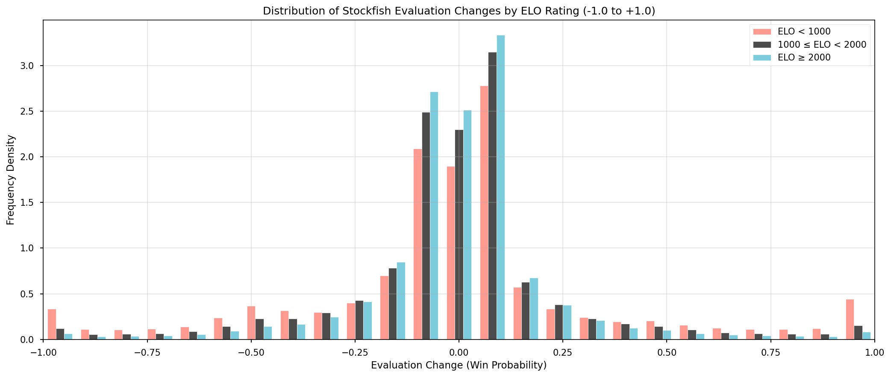

After evaluating 60,000 moves (20,000 moves for Elo < 1000, 20,000 moves for Elo between 1000 and 2000, and 20,000 moves for Elo > 2000), we can assume that according to Stockfish's neural network, low-Elo players are not the best group of chess players.

More seriously, this chart is not completely useless. We can see that most moves do not change the evaluation significantly, which is expected. However, we can also notice that beginners tend to play slightly more dramatic moves than the two other groups. We can especially notice a peak at -1 for the worst blunders.

If we want the engine to play like a beginner, or a low-Elo player, it means that we have to match more or less this distribution.  For simplicity, I decided to have the distribution calculated over any part of the game, instead of splitting into the beginning, mid-game, and endgame.

I then analysed the moves of a few engines, Stockfish 17 with the default settings but a depth limit if 8, Stockfish 17 with a skill level of 0, my bad chess engine with only one attempt, and, of course, the first alphabetical UCI move and the random move.

To evaluate my bad chess engine, my laptop computed 8,000 samples. I let the laptop run overnight, computing the next best move after a succession of plays from real humans. I used the same samples to evaluate the other engines, but the human players samples are different because I messed up. And I don't want to redo the whole thing. However, I think the distribution is still sufficiently representative.

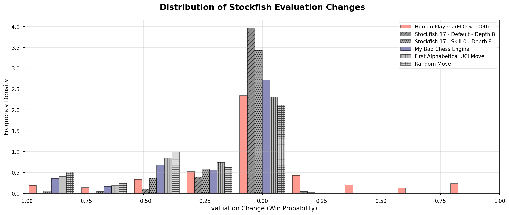

From this chart, we can observe that, according to Stockfish, Stockfish is pretty good at playing chess.

The evaluation goes 10 moves deep, which can explain why Stockfish restricted to 8 moves deep performs slightly worse and has slightly negative evaluations occasionally. But overall, Stockfish doesn't make blunders. Even with a skill setting of 0, major blunders are very rare for Stockfish.

We can also observe that human moves can more often improve the win probability according to Stockfish's neural network evaluation. This is a bit weird to me, and I'm not sure why this happens. Stockfish is a 'best move' engine; it expects the opponent to play the best move. Improving the win probability when it's your turn to play shouldn't happen often, from my understanding. Some noise in the evaluation is possible, but I think that humans are doing better than random noise here.

I hypothesize that humans make moves that are a bit more unique and unexpected. Perhaps Stockfish's neural network is primarily trained on simulated games. I have observed the same pattern at all Elo levels together, not only the low-Elo players. Another hypothesis is that my approach is flawed, I'm holding Stockfish incorrectly, and I misinterpret the data.

Nevertheless, my engine is pretty good at doing big blunders. We can also see that it is better than choosing the first alphabetical legal move, and it is not merely random noise. I'm happy about that.

It's certainly not matching the human players' distribution, but it's not too far off.

## With more Attempts, it gets Better

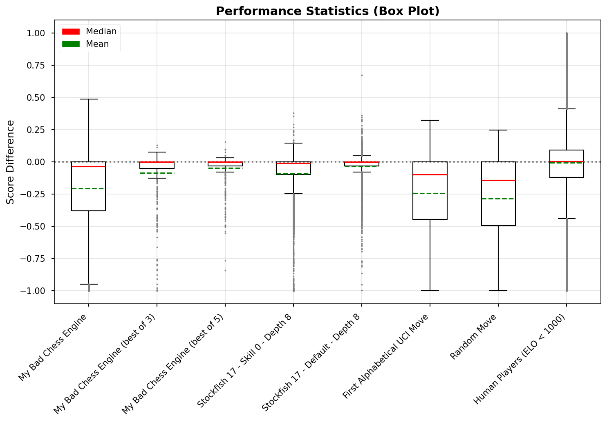

The plan was always to ask many times, so I plotted some data again with the previous engines and my bad engine with 3 and 5 attempts.

We can observe that 3 attempts are enough to achieve a median move that is somewhat 'good enough'. Five attempts are perhaps a bit too good.

I will have to tune the number of attempts later, but the good news is that I don't need too many attempts to get decent moves.

## Evaluating moves, when Stockfish's Neural Network Gives Up

I discovered that sometimes Stockfish's neural network (NNUE) evaluation gives up, or saturates. It will evaluate a position as a 100% loss, 100% win, or 100% draw. And whatever you do next, the evaluation will likely not change. I anthropomorphize this as Stockfish saying "this situation is hopeless, sorry", "this is 100% a win, I'm so good", "this is obviously a draw, let's go home".

This is somewhat uncommon and perhaps occurs more frequently on unusual boards, towards the late games. The issue usually disappears after a few moves. I have noticed this exact same behaviour on the Chess.com application once in a while, so I guess it's not from my code nor my usage of Stockfish. Although it may very well be the case.

In such situations, I decided to skip the neural network evaluation and use the classic centipawn evaluation instead. The centipawn evaluation is a simpler number that represents the potential material advantage of a player. Losing a pawn is -100, losing a knight is -300, and losing a queen is -900; conversely, gaining a pawn is +100, and gaining a queen is +900. I also decided that losing the game is -10,000 and winning the game is +10,000. It's not perfect, but it's better than nothing.

However, I haven't conducted a statistical analysis of the centipawn evaluation of my engine versus human players, so when this issue occurs, I just take the best out of all the attempts. In practice, it means that the bad chess engine may play slightly slower and better for a few moves. You can definitely notice it when you play against it, but it's not a major issue.

The updated code looks like this:

```python
def evaluate_board(board, inverse_turn=False):
    info = stockfish.analyse(board, chess.engine.Limit(depth=12))
    score = info["score"].pov(board.turn ^ inverse_turn)
    wdl = score.wdl(ply=board.ply())
    return wdl.expectation(), score.score(mate_score=10_000)

EXPECTATION_SATURATION = 0.95
EXPECTATION_SATURATION_EPSILON = 0.01
EXPECTATION_DIFF_EPSILON = 0.05
CENTIPAWN_DIFF_THRESHOLD = 1

def is_evaluation_saturated(expectation_before, expectation_diff, score_diff):
    """Check if evaluation is saturated based on thresholds."""
    return (
        abs(expectation_before) > EXPECTATION_SATURATION and
        abs(expectation_diff) < EXPECTATION_DIFF_EPSILON and
        abs(score_diff) > CENTIPAWN_DIFF_THRESHOLD
    ) or (
        abs(expectation_before) < EXPECTATION_SATURATION_EPSILON and
        abs(expectation_diff) < EXPECTATION_SATURATION_EPSILON and
        abs(score_diff) > CENTIPAWN_DIFF_THRESHOLD
    )
```

## Is the LLM Actually Useful?

Now that we have a hybrid chess engine using Stockfish, perhaps the LLM is unnecessary weight after all. In engineering, it's important to remove unnecessary complexity. Even when you have put a lot of love and effort into it.

So, I implemented the `NoLLM` option in the chess engine. Instead of asking the LLM to think, reflect, and then select a legal move, it only picks a random legal move and uses Stockfish to decide whether it's a good move or not. I also increased the number of attempts to find a good move to 16, using the `MaxAttempts` option. It shouldn't be too high, because at some point, you just have a very contrived way of playing with Stockfish. The number of attempts shouldn't also be too low, because it's truly terrible when low.

Configuration for lichess-bot:

```yaml
  uci_options:
    NoLLM: true
    MaxAttempts: 16
```

A few games show that the LLM is indeed useful. With 16 attempts, the engine without using the LLM plays at a decent low-Elo level, but it doesn't feel like a beginner. Many unrealistic and unlikely blunders occur. The behaviour is that of a common bad chess engine that is pretty good, except occasionally when it plays a terrible random move.

I haven't taken the time to capture this with numbers, so I suggest a qualitative analysis with a sample size of one instead (me). I played a few games against the engine without the LLM, and I enjoyed none of them. I feel that the LLM is actually succeeding at making the engine play more like a human beginner. Of course, I have some bias. It would be better to have more human beginner players test it eventually.

Nevertheless, I'm glad that I feel the LLM's complexity isn't there for no reason.

## Tuning and Magic Numbers

An important part of a chess engine is tuning the many parameters with magic numbers. I haven't found optimal values yet, as it requires a lot of play-testing and analysis. I found during testing that 4 attempts works fine for me. Furthermore, I also feel the engine can be a bit too good at finding check and mate moves for my taste, but perhaps I should get better at endgames. Or perhaps I should lower the number of attempts for endgames.

## When the time is running out, the bot will panic

In chess games with a clock, players have a limited amount of time to make their moves. If time runs out, the player loses the game. These kinds of chess games are very common on Lichess.

Using a LLM takes a significant amount of time, sometimes more than 10 seconds, which can eventually cause the bot to lose on time. To prevent this, I implemented a panic mode. If the bot timer goes below a certain configurable threshold, 15 seconds by default, the bot will panic and consider random moves instead of using the LLM. It will certainly play worse, but at least it will not lose on time.

## If I Had To Do It Again

I have been told that you have to build something twice to build it right once. I'm quite satisfied with the current version, but if I were to do it again, I would probably look for a better LLM, do more prompt engineering, and significantly improve the training dataset.

If I were very ambitious, with no family, and living in a place with boring nature, I would consider combining a LLM transformer architecture with a AlphaZero-like neural network in a single hybrid model. And do some reinforcement learning and self-attention stuff. That would require a lot of scaling up my AI knowledge and skills, which is the interesting part.

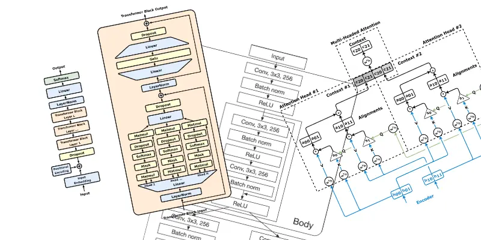

— I would have to understand diagrams like those.

## You Can Play Against It

My company, [SINTEF](https://www.sintef.no/), is hosting the bot so anyone can play against it. The effort is maintained by myself on a best-effort basis, so it may be offline from time to time, but it should be up most of the time.

- You can play against it on Lichess at [https://lichess.org/@/nittedal](https://lichess.org/@/nittedal).
- You can also [play it in your web browser.](https://fungiboletus.github.io/chess-potato-ai-3000/)

If you're interested in self-hosting, the complete source code is available on GitHub at [https://github.com/fungiboletus/chess-potato-ai-3000](https://github.com/fungiboletus/chess-potato-ai-3000). The source code is open-source under the GPL3 licence, so you're free to use, modify, and host it yourself.

I also provide the model weights, but those are "open-weights" rather than "open-source" as I "lost" the training dataset. Providing a binary with no sources is a common practice in the AI community, and I feel dirty about it. I'm sorry. Next time, I will use an open-source training dataset, because open source values and respecting the authors are somewhat important to me. Nethertheless, the open-weights are available on HuggingFace at [https://huggingface.co/undefined2/chess-potato-ai-3000](https://huggingface.co/undefined2/chess-potato-ai-3000). Under a Gemma license this time.

## There is No Conclusion

Thanks for scrolling down to the bottom of this article. I don't have more to write about this personal project. If you are seeking for a summary, you can check the highlights at the top of the article.

— Antoine Pultier - 2025 and 2026 (it took a while).
